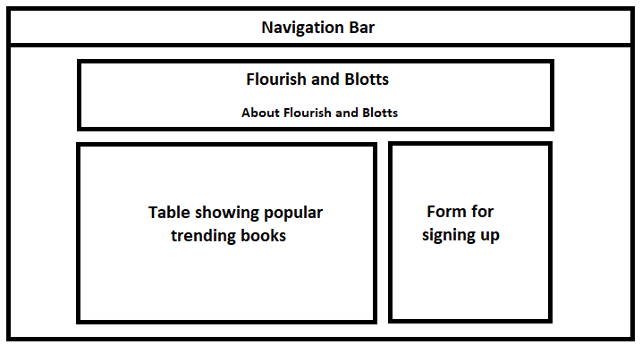
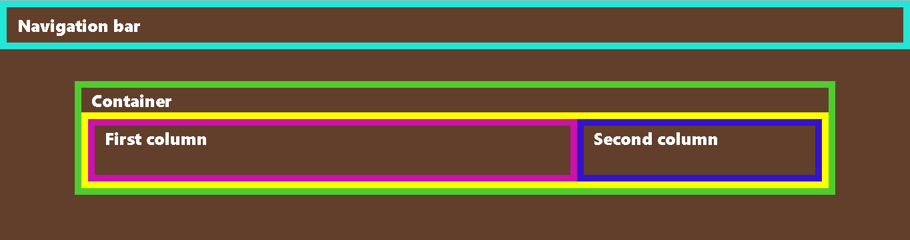
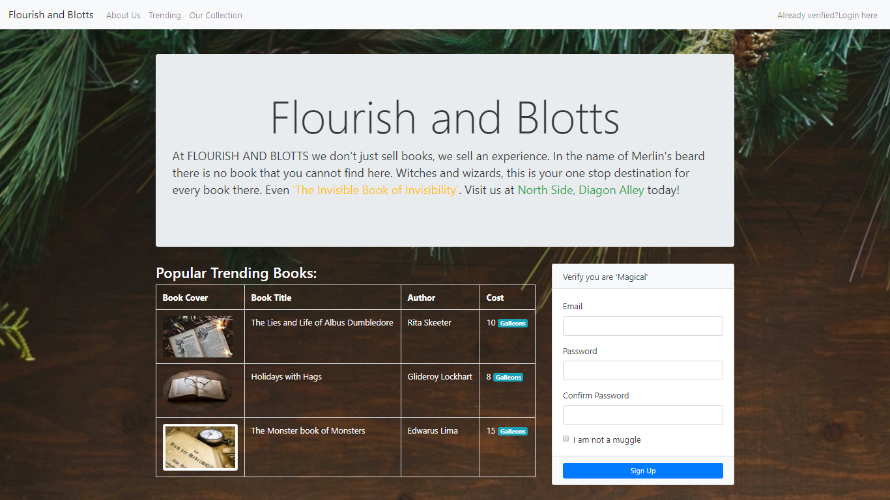
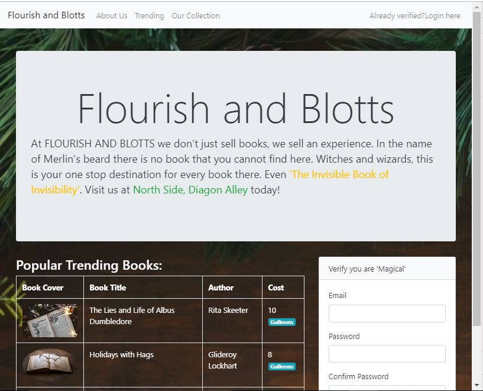

## About
- Install `live server` extension on VsCode and open `index.html` with it 
- Everything else in project is to run html in node with live-reload in browser

## Issues
- How to deploy `index.html` to cloud? Impossible.

## Bootstrap Grid System
- In bootstrap we devide into grid system: divide width into 12 columns because it is divisible by 2,3,4,6
- container work like col classes and have padding in them, but containers take the whole space available, so containers are `col-12`
- row classes remove padding: do not put rows inside rows directly, or col in col. rows should be nested in `container` or `col-` classes
- see `index.html`

## Container
- `container` is fixed-width-container that changes width as the screen width change. Allow some left and right space before the container starts. 
- `container-fluid` always takes the whole width of the browser window

## Card
- Default is no padding and rounded corners 
- `card-body`, `card-header`, `card-footer`

## Form
- `form-control` class takes 100% of the space available and all other elements are above or below it. Default padding, shadows etc.
- checkboxes and radio button do NOT use `form-control` but instead use `form-check-input`, `form-check-label`, `form-check` on the div that groups the label and the input together

## Border, Margin and Padding
- Can be individually controlled for each of the 4 sides of a box
- 4 sides of box in CSS direction (clockwise direction): top, right (`end`), bottom, left (`start`)
- To be specific to one of the sides, add `-sideName` to the classes (e.g. border-top, margin-bottom, padding-left)
- Bootstrap shortcuts: `m` for margins, `p` for padding
- In bootstrap 5: 
    - `ms-4` means margin-left 4
    - `pe-3` means padding right 3. 
    - For both top and bottom should use y coordinate (e.g. `py-2`, `my-4`)
    - For both left and right use x coordinate (e.g. `px-1`, `mx-5`)
    - `me-4` might be used a log for adding space below elements

## Text Formatting
  - text size `display-n` where n goes from 1 to 6 is used to have larger font sizes, with 1 being largest, 6 is small yet still big
  - alignment: `text-start`, `text-end`, `text-center`
  - colour for text: `text-primary`, `text-danger`
  - transformation: `text-capitalize` (first letter of every word uppercased), `text-uppercase`, `text-lowercase`
  - table: need to be added in table tag
    - `table`: base class always needed
    - `table-bordered`: all cells have borders
    - `table-sm`: less padding in cells
    - `table-striped`: alternate background colour or grey and white
    - `table-hover`: background colour of grey when hoverying on a row
    - `table-responsive`: horizontal scrollbar if any word inside the cell is too long; instead of overflowing

## Responsive Web Design
- depending on the width of the screen, our LAYOUT can change
- bootstrap allows to code for different screenwidth
- if we want a property to apply to specific screen widths, names are: `sm` for small, `md` for medium, `lg` for large, `xl` for extra-large, `xxl` for extra-extra-large
- example class: `col-md-4` => apply the col width property to ALL SCREEN LARGER or EQUAL to MEDIUM SCREEN WIDTH
- Rules:
  - All screens larger than `sm`: 50% of availabke width should be applied
  - All screens larger than `md`: 33% of available width should be applied
  - All screens larger than `lg`: 25% of available width should be applied
  - All screens larger than `xl`: 16.67% of available width should be applied
  - size between extra small/0 width till `sm` width use 100% of a available width
  - for all the size in between size, use the smaller bound
  - `col-n` for all widths use n/12 available width
  - `offset` moves our element n/12 of available width to right from where it was originally supposed to be. reaed offset as move to right n columns out of 12 columns

------------------------------------------------------------------------------------

  
  

  
  

  
  

  
  

  

